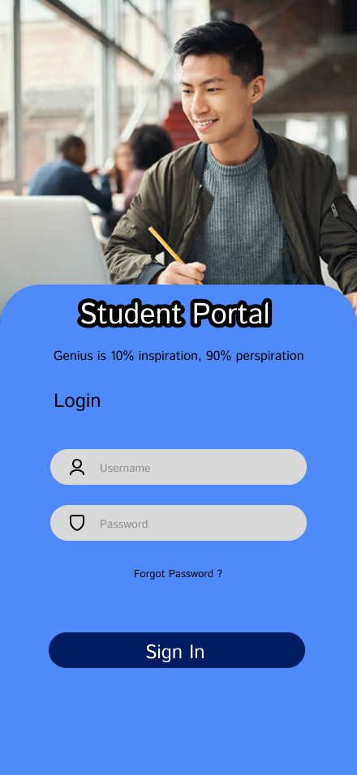
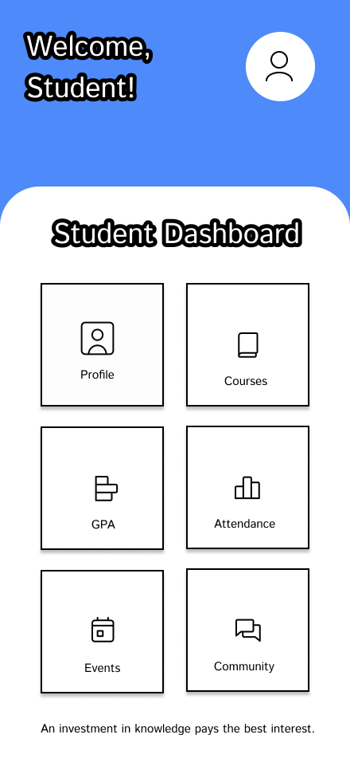
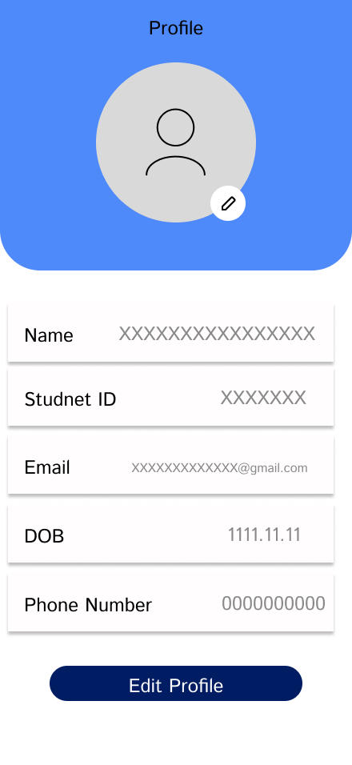
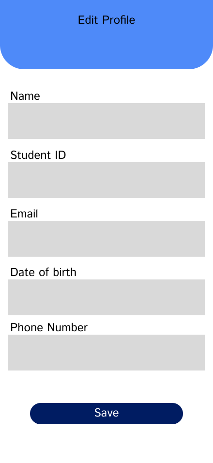

# Student Portal UI Design

A simple mobile app concept I designed in Figma for a university student portal. Built this to practice app layout, button components, and user flows.

## Screens
- **Login Page:** Basic sign-in view
- **Dashboard:** Grid menu for quick access (GPA, Attendance, Courses, Events, Community)
- **Profile & Edit Profile:** Viewing and updating student details

## Preview

*Tool used: Figma*
